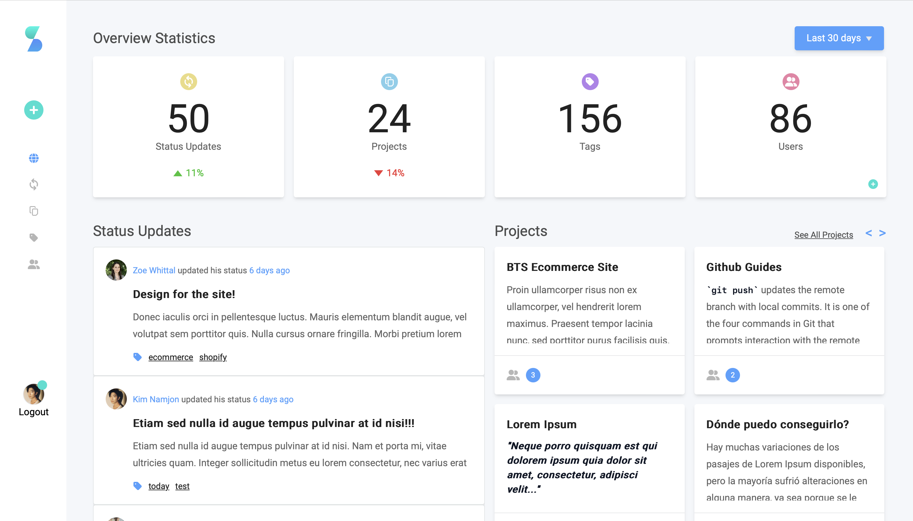

<div align="center">
    <h1>Sitdown App</h1>
    <image src="https://github.com/learsiOtni/sitdown-next-app/blob/main/src/assets/img/small-logo.png" alt="sitdown app logo">
    <br />
    <br />
    <p>A web app to help you manage multiple team projects.</p>
    <a href="https://sitdown-next-app.vercel.app/login">
      <strong>View Demo</strong>
    </a>
    <br />
    <br />
</div>

## About the Project

 

Sitdown app is a web application where users can create projects, write the project description, add members to the projects, and the added members can post status updates about the project with relevant tags.  

I converted a UI design from [Adobe XD](https://xd.adobe.com/view/dd6bbf87-41bb-4196-a87b-15ebf31ff0bc-8838/specs/?fbclid=IwZXh0bgNhZW0CMTAAAR0ZRBR0ETV0urundu9y7qu-KMyMowjEfABJg3CIHEavuhO_jgvA7CUxJ64_aem_AdY8OcPzJJwmj7y5xdqCDrMPWNVUufNl25Osb5gHqtnEAPXI7RTzGHt03NDlDcCchEp8zpdGRt8U6VZBs5s5yuHN) into a working code. 

</br>

### Technology stack

##### Front-End: (Deployed with Vercel)
* Next.js 
* Typescript
* Tailwind
* Redux
* ESLint
* Tiptap Editor

##### Back-End: (Deployed with Firebase)
* Express.js
* Firebase Cloud Firestore Database
* Firebase Cloud Functions

</br> 

### Features
* Pop-up form to add or edit status updates.
    * Tags validation. Remove duplicates and white spaces.
    * Delete status updates.
* Pop-up form to add or edit projects.
    * Custom Select Members Input.
    * Delete projects.
* Status updates view by current date. 
    * Provides table or card view options. 
* A rich text editor for adding descriptions to status updates and projects.
* A Tags page showing all the added tags, and clicking a tag will show all the relevant statuses containing that tag.
* Change profile picture.
* Form validation at the server side.
* Loading Skeleton while the web app fetches data from the database.

</br>

### Getting Started
Get the project running on your local server.

1. Clone the repository.

2. Add this to your .env.local
```sh
NEXT_PUBLIC_API_URL="https://us-central1-sitdown-834fc.cloudfunctions.net/api/"
```

3. Install the NPM packages
```bash
npm install
```

4. Run the development server
```bash
npm run dev
# or
yarn dev
# or
pnpm dev
```

5. Open [http://localhost:3000](http://localhost:3000) with your browser to see the project.